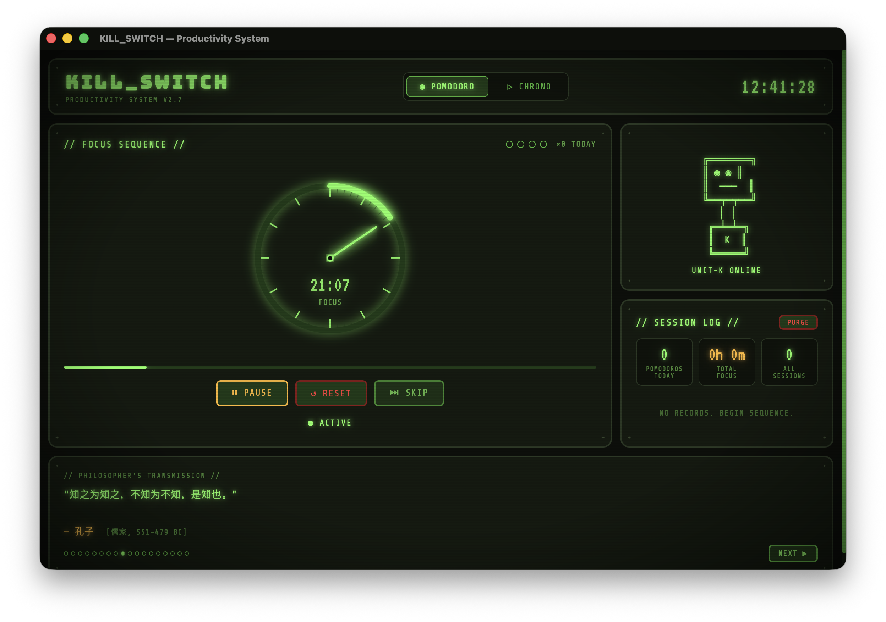

# ☢ KILL_SWITCH

> *"The impediment to action advances action. What stands in the way becomes the way."*  
> — Marcus Aurelius

A retro-futuristic productivity timer for macOS. Built with Tauri + React, styled after the Pip-Boy aesthetic — dark terminals, green phosphor glow, analog dials, and atomic-age typography.



---

## Features

### ⏱ Pomodoro Timer
- **25-minute focus** → **10-minute break**, auto-cycling
- SVG analog dial with 60-tick gauge + sweep hand
- Countdown updates live in the **macOS menu bar** (`☢ 24:37`)
- Warning beeps in the final 5 seconds
- Triple-tone completion sound via Web Audio API
- Session dot tracker + today's pomodoro count

### ▷ Chrono Logger (Count-Up Timer)
- Free-running stopwatch (HH:MM:SS)
- **Lap recording** with per-lap split times
- Save completed sessions to local history

### 💬 Philosopher's Transmission
- 18 curated quotes — Stoic, Confucian, Existentialist, Absurdist
- Typewriter animation on each new quote
- Auto-cycles every 12 seconds; click dots to jump directly

### 📊 Session Log
- Full history stored in **localStorage** (persists across launches)
- Today's stats: pomodoros completed, total focus time, all-time sessions
- Daily pomodoro counter auto-resets at midnight

### 🖥 Native macOS Integration
- **Menu bar presence** — live countdown visible without opening the window
- **System notifications** on focus complete and break complete
- **Close → hide to tray** (window hides, app keeps running)
- **Window geometry persistence** — remembers your last position and size

---

## Installation

### Option A — Download DMG (macOS Apple Silicon)

1. Download `KILL_SWITCH_0.1.0_aarch64.dmg` from [Releases](https://github.com/JackSuuu/kill_switch/releases)
2. Open the DMG and drag `KILL_SWITCH.app` to `/Applications`
3. First launch: right-click → **Open** (bypasses Gatekeeper for unsigned apps)
4. Allow notifications when macOS prompts

### Option B — Build from Source

#### Prerequisites

| Tool | Version | Install |
|------|---------|---------|
| Node.js | ≥ 18 | [nodejs.org](https://nodejs.org) |
| Rust | ≥ 1.60 | `curl --proto '=https' --tlsv1.2 -sSf https://sh.rustup.rs \| sh` |
| Xcode CLI Tools | any | `xcode-select --install` |

#### Steps

```bash
# 1. Clone
git clone git@github.com:JackSuuu/kill_switch.git
cd kill_switch

# 2. Install JS dependencies
npm install

# 3. Build the macOS app
npm run tauri:build

# 4. Open the app
open src-tauri/target/release/bundle/macos/KILL_SWITCH.app
```

The DMG is also produced at:
```
src-tauri/target/release/bundle/dmg/KILL_SWITCH_0.1.0_aarch64.dmg
```

---

## Development

```bash
# Hot-reload dev mode (React + Rust simultaneously)
npm run tauri:dev

# Frontend only (browser preview, no native features)
npm run dev
```

The frontend runs at `http://localhost:5173`. All `invoke()` calls to Tauri gracefully no-op when running in a plain browser, so the UI is fully previewable without the native wrapper.

---

## Usage

### Pomodoro Timer

1. Click **▶ START** to begin a 25-minute focus session
2. The menu bar shows the live countdown — you can hide the window and keep working
3. When the session ends, a macOS notification fires and the break phase begins automatically
4. After 10 minutes of break, another notification fires and the cycle resets
5. Each completed focus session is logged in the Session Log panel

### Chrono Logger

1. Switch to **▷ CHRONO** tab in the header
2. Click **▶ START** to begin counting up
3. Click **◎ LAP** to record split times while running
4. Click **⏹ STOP** to pause, then **✦ SAVE** to commit the session to history
5. Click **↺ RESET** to clear and start fresh

### Menu Bar

| Action | How |
|--------|-----|
| See live countdown | Look at the `☢` icon — it shows current time remaining |
| Show window | Left-click the menu bar icon |
| Quit app | Right-click → **Quit KILL_SWITCH** |

### General Controls

| Action | Control |
|--------|---------|
| Start / Resume | **▶ START** / **▶ RESUME** |
| Pause | **⏸ PAUSE** |
| Skip current phase | **⏭ SKIP** |
| Reset timer | **↺ RESET** |
| Record lap | **◎ LAP** (Chrono only) |
| Save session | **✦ SAVE** (Chrono only, after stopping) |
| Clear all history | **PURGE** in the Session Log panel |
| Hide window | Click the red close button — app lives in menu bar |

---

## Project Structure

```
kill_switch/
├── src/                        # React frontend
│   ├── components/
│   │   ├── AnalogDial.tsx      # SVG gauge dial (60 ticks, sweep hand, arc progress)
│   │   ├── PomodoroTimer.tsx   # 25/10 min timer + tray + notification hooks
│   │   ├── CountUpTimer.tsx    # Stopwatch with lap recording
│   │   ├── QuoteTicker.tsx     # Typewriter philosopher quotes
│   │   ├── RobotMascot.tsx     # ASCII robot UNIT-K
│   │   └── HistoryPanel.tsx    # Session log + daily stats
│   ├── hooks/
│   │   ├── useStorage.ts       # localStorage helpers, Web Audio beep
│   │   └── useTauri.ts         # Safe invoke() wrapper (browser-compatible)
│   ├── data/quotes.ts          # 18 philosopher quotes
│   └── styles/
│       ├── global.css          # CSS variables, CRT scanline overlay, glow utilities
│       └── layout.css          # Component layout styles
│
├── src-tauri/                  # Rust / Tauri backend
│   ├── src/main.rs             # Tray, notifications, window geometry persistence
│   ├── tauri.conf.json         # Window config, bundle ID, allowlist
│   ├── Cargo.toml
│   └── icons/                  # App icons (generated by gen_icons.py)
│
└── gen_icons.py                # Pillow script to regenerate all icon sizes
```

---

## Data & Privacy

All data is stored **locally only**:

| Data | Location |
|------|----------|
| Session history, stats | `localStorage` in the app's WebView |
| Window position & size | `~/Library/Application Support/com.killswitch.productivity/window_geometry.json` |

No network requests. No analytics. No accounts.

---

## Tech Stack

| Layer | Technology |
|-------|-----------|
| Frontend | React 18 + TypeScript + Vite 4 |
| Styling | Pure CSS — custom properties, `@keyframes`, no UI framework |
| Fonts | VT323 · Share Tech Mono · Bungee (Google Fonts) |
| Native shell | Tauri 1.8 (Rust + macOS WebKit) |
| Notifications | `tauri::api::notification` |
| Tray | `tauri::SystemTray` |
| Persistence | `localStorage` (sessions) + `AppData` JSON (window geometry) |
| Audio | Web Audio API (`OscillatorNode` square wave beeps) |
| Icons | Python + Pillow → `iconutil` → `.icns` / `.ico` |

---

## Philosophy

This tool is built on one idea: **focused work, clearly tracked, with zero friction**.

The retro aesthetic is intentional. Modern productivity apps compete for your attention with gradients, dashboards, and dark patterns. KILL_SWITCH looks like a piece of hardware — a switch you flip. It does one thing and gets out of your way.

> *"学而不思则罔，思而不学则殆。"*  
> Learning without thought is labor lost; thought without learning is perilous.  
> — 孔子

---

## License

MIT
